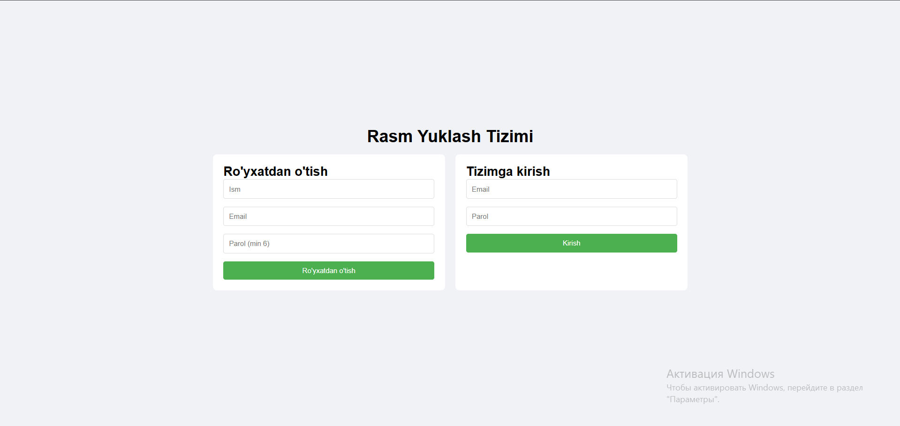
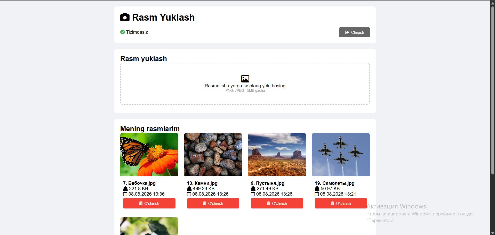

# Image API

A simple REST API for user authentication and image management built with Laravel.

## Features

- User registration and login
- Laravel Sanctum authentication
- Protected API routes
- Upload PNG/JPG images
- Maximum file size: 5 MB
- Automatic WebP conversion
- Duplicate image detection
- View and delete user images

## Technologies

- PHP
- Laravel 10
- Laravel Sanctum
- MySQL
- Intervention Image 3

## Screenshots

### Login / Register

### Image Upload

 
 